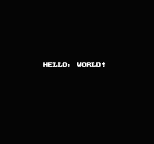

# nes.cr

NES(Nintendo Entertainment System) emulator written in Crystal 💎

## Usage

```sh
$ git clone git@github.com:guri3/nes.cr.git
$ cd nes.cr
$ make setup
$ make build
$ ./nes
```

## Screenshot

### Hello World



### nestest

🚧

### Super Mario Bros.

🚧
